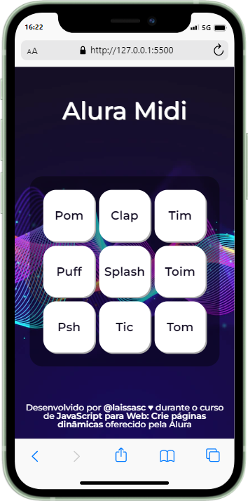
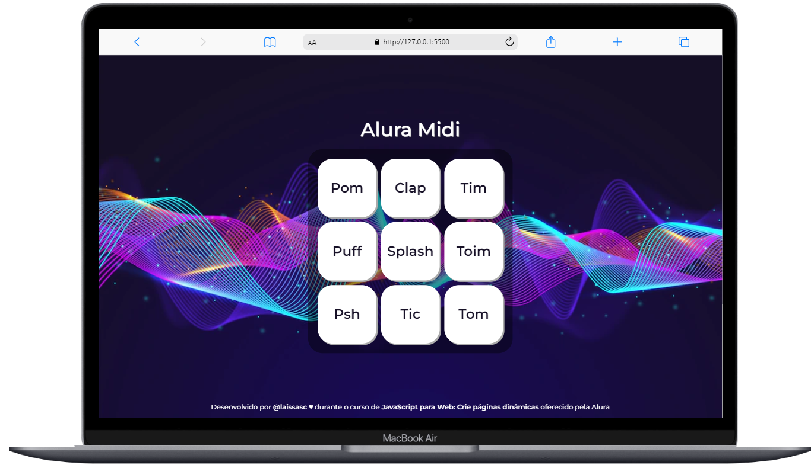

# Alura-midi 👩🏾‍💻 

&nbsp;
&nbsp;
&nbsp;
&nbsp;
&nbsp;
 

> ### Projeto desenvolvido durante o curso 'JavaScript para Web: Crie páginas dinâmicas' da Alura com a instrutora Vanessa Me Tonini.

  

.

.
